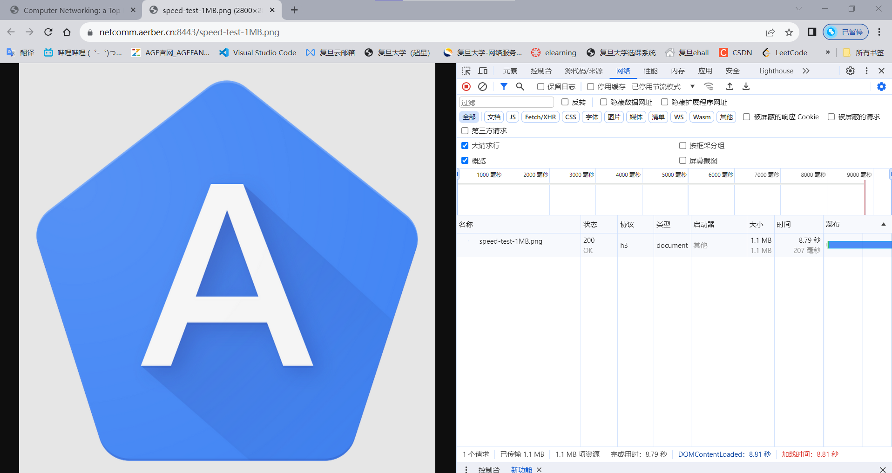

# 计算机网络PJ

21302010042
侯斌洋

***

## 一、浏览器测量

（1）环境：windows

（2）工具：Chrome 120.0.6099.71（正式版本） （64 位）

（3）测量对象：对于图片，测量资源加载时间，对于html页面，测量页面加载时间。加载时间均以chrome控制台网络页下显示的时间为准。

（4）测量过程截图：

测量过程较长，在此只列出一个例子。如下所示，统计的时间即为右下角红字的加载时间。测量过程中显示协议来确保正确性。因为h3在最开始需要h1.1的alt-src响应头，故在测量像照片这样的单个资源而不是html页面时，需要先访问同端口的html文件让浏览器知道后续可以使用h3。在用chrome浏览器测量h3时这点尤为重要，特此说明。



### （5）测量结果

为减小误差，测量结果为测5次取平均值，在Excel中记录，结果在 result.xlsx 的chrome工作表中。**（注：在此处及下面提到的各种文件都在src目录中）**

#### HTTP1.1


#### HTTP2


#### HTTP3


### （6）分析


以上为平均时间对比图。可以看出，无论是请求单个文件还是html页面，h1.1和h2的性能十分相近，且h2会略慢一点。h3的性能则明显要高很多，在请求大文件和大页面时尤为显著，速度大致为h1.1和h2的两倍。由此看出，在从h1.1到h2的更迭中性能并没有提升，而从h2到h3的过程中性能显著提升。浏览器采用QUIC的确能在很大程度上提升网页访问速度。

## 二、命令行发送请求

（1）环境：ubuntu22.04

（2）工具：
&emsp;&emsp;h1.1:  curl
&emsp;&emsp;h2:  curl  
&emsp;&emsp;h3:  ymuski/curl-http3 (in docker)

（3）测量对象：从输入curl命令开始到命令执行结束的时间，即为完整获取文件的时间。注意到对于html文件，不会加载该页面中的其他资源，仅加载该html文件。以及请求各种端口时的响应头。

（4）测量过程截图：

由于涉及的命令较多，测量时间相对教长，故写了个bash脚本来进行运行（curl.sh），如下所示：

```bash
#!/bin/bash
num_iterations=5
sync
echo ==================http1====================== >result.txt
echo ==================http1====================== 

for ((i=1; i<=$num_iterations; i++)); do
    echo "-------------Running iteration $i--------------" >> result.txt
    echo "-------------Running iteration $i--------------"
    # 1 start
    start_time=$(date +%s.%N)
    curl -k --http1.1 https://111.229.132.28:80/speed-test-100KB.jpg --output test.png
    wait
    end_time=$(date +%s.%N)
    execution_time=$(echo "$end_time - $start_time" | bc)
    echo "http1.1---100KB: $execution_time seconds" >> result.txt
    wait
    # end

    # 2 start
    start_time=$(date +%s.%N)
    curl -k --http1.1 https://111.229.132.28:80/speed-test-1MB.png --output test.png
    wait
    end_time=$(date +%s.%N)
    execution_time=$(echo "$end_time - $start_time" | bc)
    echo "http1.1---1MB: $execution_time seconds" >> result.txt
    wait
    # end

    # 3 start
    start_time=$(date +%s.%N);
    curl -k --http1.1 https://111.229.132.28:80/speed-test-5MB.jpg --output test.jpg
    wait
    end_time=$(date +%s.%N)
    execution_time=$(echo "$end_time - $start_time" | bc)
    echo "http1.1---5MB: $execution_time seconds" >> result.txt
    wait
    # end

    # 4 start
    start_time=$(date +%s.%N)
    curl -k --http1.1 https://111.229.132.28:80/speed-test-small.html --output test.html
    wait
    end_time=$(date +%s.%N)
    execution_time=$(echo "$end_time - $start_time" | bc)
    echo "http1.1---small: $execution_time seconds" >> result.txt
    wait
    # end

    # 5 start
    start_time=$(date +%s.%N)
    curl -k --http1.1 https://111.229.132.28:80/speed-test-medium.html --output test.html
    wait
    end_time=$(date +%s.%N)
    execution_time=$(echo "$end_time - $start_time" | bc)
    echo "http1.1---medium: $execution_time seconds" >> result.txt
    wait
    # end

    # 6 start
    start_time=$(date +%s.%N)
    curl -k --http1.1 https://111.229.132.28:80/speed-test-large.html --output test.html
    wait
    end_time=$(date +%s.%N)
    execution_time=$(echo "$end_time - $start_time" | bc)
    echo "http1.1---large: $execution_time seconds" >> result.txt
    wait
    # end

    echo "-----------------------------------------------" >> result.txt
    echo "-----------------------------------------------"
    wait
done

echo ============================================= >>result.txt
echo =============================================
wait

# head
echo ===================http1==================== 1>head.txt;
echo ===================http1====================
curl -k --http1.1 https://111.229.132.28:80/speed-test-100KB.png --head 1>>head.txt;
wait
curl -k --http1.1 https://111.229.132.28:80/speed-test-1MB.png --head 1>>head.txt;
wait
curl -k --http1.1 https://111.229.132.28:80/speed-test-5MB.jpg --head 1>>head.txt;
wait
curl -k --http1.1 https://111.229.132.28:80/speed-test-small.html --head 1>>head.txt;
wait
curl -k --http1.1 https://111.229.132.28:80/speed-test-medium.html --head 1>>head.txt;
wait
curl -k --http1.1 https://111.229.132.28:80/speed-test-large.html --head 1>>head.txt;
wait
echo ============================================ 1>>head.txt;
echo ============================================
```

以上为对于 http1.1的测试时间和响应头的命令。其他对于h2和h3的测量命令与此类似，可详见文件。


### （5）测量结果

为减小误差，测量结果为测5次取平均值，在Excel中记录，结果在result.xlsx的curl工作表中（curl.sh运行结果在m_result.txt中）。

#### HTTP1.1


#### HTTP2


#### HTTP3


#### head
以h1.1的head为例，h2和h3的可见 m_head.txt。

```sh
===================http1====================
HTTP/1.1 200 OK
Server: nginx/1.25.2
Date: Thu, 07 Dec 2023 12:15:46 GMT
Content-Type: /image/image/png
Content-Length: 98763
Last-Modified: Mon, 23 Oct 2023 07:53:25 GMT
Connection: keep-alive
ETag: "65362675-181cb"
Accept-Ranges: bytes

HTTP/1.1 200 OK
Server: nginx/1.25.2
Date: Thu, 07 Dec 2023 12:15:48 GMT
Content-Type: /image/image/png
Content-Length: 1128358
Last-Modified: Mon, 23 Oct 2023 07:53:22 GMT
Connection: keep-alive
ETag: "65362672-1137a6"
Accept-Ranges: bytes

HTTP/1.1 200 OK
Server: nginx/1.25.2
Date: Thu, 07 Dec 2023 12:15:49 GMT
Content-Type: /image/image/jpeg
Content-Length: 5048759
Last-Modified: Mon, 23 Oct 2023 07:53:25 GMT
Connection: keep-alive
ETag: "65362675-4d09b7"
Accept-Ranges: bytes

HTTP/1.1 200 OK
Server: nginx/1.25.2
Date: Thu, 07 Dec 2023 12:15:50 GMT
Content-Type: text/html
Content-Length: 5885
Last-Modified: Mon, 23 Oct 2023 08:02:38 GMT
Connection: keep-alive
ETag: "6536289e-16fd"
Accept-Ranges: bytes

HTTP/1.1 200 OK
Server: nginx/1.25.2
Date: Thu, 07 Dec 2023 12:15:51 GMT
Content-Type: text/html
Content-Length: 92550
Last-Modified: Mon, 23 Oct 2023 07:55:47 GMT
Connection: keep-alive
ETag: "65362703-16986"
Accept-Ranges: bytes

HTTP/1.1 200 OK
Server: nginx/1.25.2
Date: Thu, 07 Dec 2023 12:15:53 GMT
Content-Type: text/html
Content-Length: 229404
Last-Modified: Mon, 23 Oct 2023 08:12:02 GMT
Connection: keep-alive
ETag: "65362ad2-3801c"
Accept-Ranges: bytes

============================================
```

### （6）分析


以上为平均时间对比图。由于html文件自身比较小，故使用命令行请求时差距不大。在对于大文件的请求上，则与使用浏览器得到的结论类似。h3速度大致为h1.1和h2的两倍。故在命令行上请求文件时采用QUIC也能在很大程度上提升网页访问速度。

## 三、wireshark抓包

（1）环境：ubuntu22.04

（2）工具：wireshark

（3）测量对象：由于主要目的为抓取HTTP请求过程中的网络数据包，识别在此过程中涉及到的网络协议，并对相关协议进行分析。故对于每个协议均以请求100KB.png文件的head为示例来进行分析。

（4）测量过程截图：

如下在ubuntu中打开wireshark。可选择any或ens33网卡来进行检测


选择any并设置过滤器规则，这里设置 ip.addr == 111.229.132.28 过滤发往或来自 111.229.132.28 的包。


另起一个终端并发送h3请求便可捕获包并分析。


### （5）测量结果及分析

在 result.xlsx 的wireshark工作表中。

#### HTTP1.1

curl -k --http1.1 https://111.229.132.28:80/speed-test-100KB.png --head


可以看出http1.1使用的传输层协议为TCP。SYN标志位用于建立连接。c（client）首先向s（server）发送SYN报文请求建立连接，s再以SYN和ACK回应，c收到ACK再以ACK回应，这样c/s之间的连接就建立起来了。ACK标志位用于确认收到数据，PSH用于推送数据，c/s之间使用这两种标志进行数据通信。FIN用于结束连接，c/s双方都确认了FIN后连接终止。

#### HTTP2

curl -k --http2 https://111.229.132.28:443/speed-test-100KB.png --head


可以看出http2使用的传输层协议为TCP，TLSv1，TLSv1.3。TLS位于 OSI 模型的安全层，用于在应用层和传输层之间提供安全性。TLS协议通常建立在TCP之上，通过对数据进行加密和认证来保护通信的隐私和完整性。http2使用了TLS对数据进行了加密。在使用TCP建立连接后，http2的双方还要再进行一次TLS层的hello的握手。之后的带有数据的报文均通过TLS传递，ACK和FIN此类不包含数据的报文则可继续通过TCP传输。最后终止连接也是使用TCP的FIN标志。

#### HTTP3

docker run -it --rm ymuski/curl-http3 curl -IL https://netcomm.aerber.cn:8443/speed-test-100KB.png --http3-only --head


可以看出http3使用的传输层协议为QUIC。QUIC（Quick UDP Internet Connections）是一个基于UDP的传输层协议，旨在提供更快的连接建立和更低的延迟。Initial是QUIC协议中建立新连接时的初始阶段。在这个阶段，客户端和服务器之间进行初始通信以建立连接。Handshake是QUIC协议中的安全建立连接的阶段。在这个阶段，客户端和服务器交换加密信息以建立安全的通信渠道。Protected Payload是在QUIC连接建立并完成握手后传输的数据。这些数据受到加密保护，并通过QUIC通道进行传输。QUIC协议Handshake过程基于TLS 1.3，数据传输过程基于UDP。最后QUIC关闭连接也是通过Protected Payload进行。

## 四、使用弱网工具

（1）环境：windows

（2）工具：
&emsp;&emsp;Chrome 120.0.6099.71（正式版本） （64 位）
&emsp;&emsp;clumsy 0.3

（3）测量对象：不同端口下的1MB.png文件的加载时间。分别测量以下7种情况：
1. 正常情况
2. 延迟100ms
3. 10%节流
4. 10%重复
5. 10%乱序
6. 限制带宽60KB/s
7. 10%损坏

（4）测量过程截图：

如下所示：clumsy中的选项一闪一闪:sparkles:即为正在模拟弱网。


### （5）测量结果

为减小误差，测量结果为测3次取平均值，在Excel中记录，结果在 result.xlsx 的using_chumsy工作表中。

#### HTTP1.1


#### HTTP2


#### HTTP3


### （6）分析


如上图所示：normal为正常情况，在每簇的最左侧，用来进行对比。可以看出，h3在弱网环境中表现是最好的，在不限制带宽的情况下，10%的包错误和100ms的延迟对其影响都不大；而对于h1.1和h2来说，二者表现比较类似。100ms的延迟就已经对二者的传输速度影响比较大了，而10%的丢包对于传输速度的影响尤为巨大，所用时间甚至多了3-4倍。其他类型的10%包错误对其均有不同程度的影响，但都没有延迟100ms和丢包10%那样显著。而在限制带宽为60KB的情况下，这个带宽限制已经低于服务器提供的带宽，故三种协议传输速度均有所下降。其中h3对于带宽最为敏感，推测是由于h3对于带宽的利用率更高，因为文件大小为1MB，h3所用时间最接近数据传输时间。个人感觉h1.1,h2二者与h3的区别主要是由TCP和UDP的区别导致的，在进行测量的过程中，h3结果稳定性要显著高于h1.1和h2，速度也要快上不少，推测是由于UDP没有拥塞控制机制，故表现要更好。